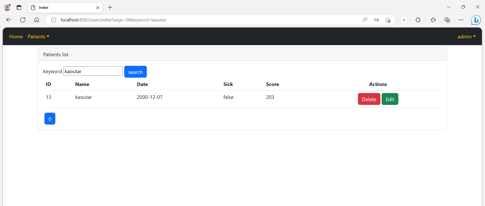

<h1>Compte Rendu</h1>
<h2>=>Partie Admin</h2>
<h3>1-Authentification</h3>

<h3>2-Afficher les patients</h3>

<h3>3-Chercher patient</h3>

<h3>4-Ajouter patient</h3>

<h3>5-Modifier patient</h3>

<h3>6-Supprimer patient</h3>

<h4>!!! La validation </h4>

<h2>=>Partie User</h2>
<h3>1-Authentification</h3>

<h3>2-Afficher les patients</h3>

<h3>3-Chercher patient</h3>
